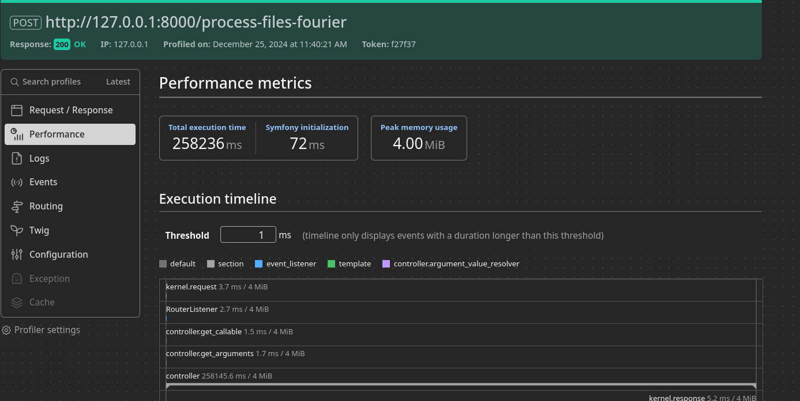

# Q1. Symfony File Comparison and Fourier Analysis Project

---

## Project Overview

This project provides a Symfony-based implementation for:
1. Calculating the binary difference between two large files in a memory-efficient manner.
2. Performing a Fourier Transform on the resulting difference file to analyze its frequency components.

The project uses chunk-based processing to ensure that memory usage stays below 8 MB, even for input files as large as 7 GB.

---

## Getting Started

### Prerequisites
1. **PHP**: Make sure you have PHP 8.2 installed 
2. **Composer**: Install Composer for dependency management.
3. **Symfony CLI**: Install Symfony 7.2 CLI to manage the Symfony server.
4. **C++ Compiler**: Ensure `g++` or any modern C++ compiler is installed.
5. **FFTW3 Library**: Install the FFTW3 library for performing Fourier Transform:
   ```bash
   sudo apt-get install libfftw3-dev
   ```

### Installation
1. Clone the repository:
   ```bash
   git clone https://github.com/SaintAngeLs/php_wobble_fump.git
   cd php_wobble_fump
   ```

2. Install dependencies:
   ```bash
   composer install
   ```

3. Set up environment variables:
   Copy `.env.example` to `.env` and configure it as needed for your environment:
   ```bash
   cp .env.example .env
   ```

---

### C++ Program Details

The Fourier Transform calculation in this project leverages a C++ implementation 
due to the lack of a robust and memory-efficient Fourier Transform library in PHP. 
This solution ensures optimal performance and scalability, particularly for large data files, by using the `libfftw3` library in the C++ programs.


#### File Difference (`file_diff`)
- **Purpose**: Perform a bitwise XOR operation between two binary files.
- **Input**:
  - `file1`: First file path.
  - `file2`: Second file path.
  - `outputFile`: Path to store the difference file.
  - `chunkSizeKB` (optional): Chunk size for processing (default: 64 KB).
- **Command**:
  ```bash
  ./file_diff <file1> <file2> <outputFile> [chunkSizeKB]
  ```

---

#### Fourier Transform (`fftlib`)
- **Purpose**: Perform a Fourier Transform on the binary difference file.
- **Input**:
  - `inputFilePath`: Path to the binary difference file.
  - `outputFilePath`: Path to store the frequency results.
  - `chunkSizeKB` (optional): Chunk size for processing (default: 64 KB).
- **Command**:
  ```bash
  ./fftlib <inputFilePath> <outputFilePath> [chunkSizeKB]
  ```

---

#### Makefile
The `Makefile` is used to compile the programs:

```makefile
make

make clean
```

Ensure `libfftw3-dev` is installed before compiling the programs.
```

## Running the Symfony Project

### Start the Symfony Server
Start the Symfony development server:
```bash
symfony server:start
```

The server will be available at `http://127.0.0.1:8000`.

---

## Running Tests

You can run the tests using the PHPUnit framework:

1. Directly with PHPUnit:
   ```bash
   php bin/phpunit
   ```

---

## Using the Profiler

### Access the Profiler
The Symfony Profiler provides insights into performance metrics and memory usage.

1. Enable the Symfony Profiler by ensuring `APP_ENV` is set to `dev` in your `.env` file:
   ```
   APP_ENV=dev
   ```

2. After running a request, open the profiler by navigating to `/_profiler` in your browser:
   ```
   http://127.0.0.1:8000/_profiler
   ```

### Interpreting the Profiler
- **Execution Time**: View the time taken by each request.
- **Memory Usage**: Confirm that memory usage stays within the 8 MB limit.
- **Logs**: Review application and test logs for debugging.

---

## Running File Comparison and Fourier Transform

### Execute CURL Command
Use the Symfony command to execute a CURL request with specified file paths:
```bash
php bin/console app:execute-curl <path1> <path2>
```

Example:
```bash
php bin/console app:execute-curl \
    /home/.../sd_xl_base_1.0_0.9vae.safetensors \
    /home/.../sd_xl_base_1.0.safetensors
```

This command sends a POST request to the `/process-files-fourier` endpoint with the provided paths and processes the files. You may also run the request with the `curl` directly or http client.

---


### Contact

For any issues or further inquiries, please contact the repository maintainer.


# Q1.2. Memory Limitation in Chunk-Based Processing

### Problem:
We process files $A$ and $B$ of size $N$ in chunks of size $M$, where $M \ll N$. We aim to prove that the maximum memory usage during processing is bounded and independent of $N$.

---

### Formulation as a Summation:
We process $k$ chunks, where:
$$
k = \lceil N / M \rceil
$$

In each step:
1. Load a chunk of size $M$ from files $A$ and $B$.
2. Perform a bitwise XOR operation.
3. Write the result to the output buffer.

The memory usage at any given time can be expressed as:
$$
\text{Memory}(t) = \underbrace{M}_{\text{chunk A}} + \underbrace{M}_{\text{chunk B}} + \underbrace{M}_{\text{output buffer}} + \underbrace{C}_{\text{constant auxiliary memory}},
$$
where $C$ is a small constant accounting for local variables.

---

### Total Memory Usage:
The memory usage for each chunk (each step $i$) is the same:
$$
\text{Memory}(i) = 3M + C
$$

The total memory usage across all chunks is:
$$
\text{Memory}_{\text{total}} = \sum_{i=1}^k (3M + C).
$$

However, what interests us is the maximum memory usage, which is limited by a single step $i$:
$$
\text{Memory}_{\text{max}} = 3M + C.
$$

---

### Example Calculations:
For a file of size $N = 7 \, \text{GB}$ and a chunk size of $M = 64 \, \text{KB}$:
$$
k = \lceil 7 \, \text{GB} / 64 \, \text{KB} \rceil = \lceil 7 \times 1024^2 / 64 \rceil = 114,688.
$$

Maximum memory usage:
$$
\text{Memory}_{\text{max}} = 3 \cdot 64 \, \text{KB} + C \approx 192 \, \text{KB} + C.
$$

The constant $C$ is negligible, e.g., $C \approx 10 \, \text{KB}$, so the maximum memory is:
$$
\text{Memory}_{\text{max}} \approx 202 \, \text{KB}.
$$

---

## Efficient Processing of Large Files

### Overview
When processing large files, memory efficiency and execution speed are critical considerations. Depending on the file size, different approaches are used to achieve optimal performance:

---

### Small Files (<50 MB)
- **Processing Strategy**: 
  - PHP processes files chunk-by-chunk, dividing them into manageable pieces (e.g., 64 KB).
  - This approach minimizes memory usage by loading only small parts of the file into memory at any time.
- **Advantages**:
  - Simple to implement with native PHP functionality.
  - Effective for files within the memory threshold.
- **Memory Usage**:
  - Memory required is proportional to the chunk size. For a chunk size of 64 KB:
    - Memory Usage = `3M + C`, where `M` is the chunk size and `C` is a small constant for overhead.
  - Example:
    - For `M = 64 KB`, memory usage is approximately 200 KB.

---

### Large Files (>50 MB)
- **Processing Strategy**:
  - Large files are processed using a C++ program that leverages efficient system calls for file handling.
  - Files are still processed in chunks, but the operation is offloaded to the C++ program to reduce memory overhead.
- **Advantages**:
  - Efficient handling of large files without consuming excessive PHP memory.
  - Offloading to C++ ensures optimized I/O operations and faster execution.
- **Trade-offs**:
  - Increases the number of I/O operations due to chunk-based processing.
  - Reduces the overall memory usage for storing chunks and cumulative memory requirements.
- **Memory Usage**:
  - Memory usage depends on the size of the buffer in the C++ program.
  - Example:
    - For a chunk size of 64 KB, memory usage is typically limited to a few hundred KB for the active buffers.

---

### Why Was Memory Usage Around 4 MB?

While the theoretical memory usage for chunk-based processing is minimal, real-world observations show memory peaks around 4 MB. Key factors include:

1. **System Buffers and Additional Variables**:
   - PHP and the operating system allocate additional buffers for managing I/O operations.
   - These buffers, along with auxiliary variables, contribute to the total memory footprint.

2. **Memory Management in PHP**:
   - PHP allocates memory in blocks. Even if a small portion of the block is used, the entire block contributes to the memory usage reported by the profiler.

3. **Additional Allocations During I/O Operations**:
   - Temporary buffers are created by PHP and the OS for reading and writing files.

4. **Memory Management in FFT Process**:
   - Fourier Transform operations involve dynamic memory allocation, especially when processing data in the frequency domain.

---

### Summary
1. **Theoretical Memory Usage**:
   - Formula: `Memory_max = 3M + C`, where `M` is the chunk size (64 KB), and `C` is a small constant for overhead.
   - For 64 KB chunks, theoretical memory usage is approximately 200 KB.

2. **Practical Memory Usage**:
   - Due to additional allocations, peak memory usage may reach up to 4 MB during file processing.

3. **Controlled Memory Usage**:
   - By processing files in chunks and offloading large files to a C++ program, memory usage is kept well below the 8 MB threshold.

---

### Conclusion
This hybrid approach combines the flexibility of PHP for small files with the performance of C++ for large files, ensuring efficient processing while maintaining low memory usage. Although the number of I/O operations increases, the trade-off is acceptable given the significant reduction in cumulative memory requirements.

### Peak Memory Usage Visualization
The following chart illustrates the memory usage during processing:


---

# Q1.3. Interpretation of Fourier Transform Results

---

### Fourier Transform Overview:
The Fourier Transform (FT) is a mathematical tool that decomposes a signal into its constituent frequencies. It is widely used in various domains, such as signal processing, physics, and data analysis, to extract frequency components from time-domain data.

---

### Interpretation of the Results:
After calculating the binary difference between the two files $A$ and $B$, we perform a Fourier Transform on the resulting data. The results can be interpreted as follows:

1. **Frequency Analysis of Differences**:
   - The FT provides insight into the frequency components of the differences between the two files.
   - Peaks in the frequency spectrum indicate dominant patterns or recurring differences at specific intervals.

2. **Noise Identification**:
   - If the difference data resembles random noise, the FT will result in a relatively flat spectrum without significant peaks.
   - If structured differences exist, the spectrum will show pronounced peaks, representing underlying patterns.

3. **Validation of Similarity**:
   - A flat spectrum with low amplitudes across all frequencies indicates that the files are highly similar, with differences being mostly random or negligible.
   - Sharp peaks or high-amplitude frequencies suggest meaningful differences that may require further investigation.

---

### Practical Applications:
1. **File Integrity Verification**:
   - By analyzing the frequency domain, one can detect subtle corruptions or alterations in one of the files compared to the other.
   - This is particularly useful in data transmission or storage verification.

2. **Pattern Recognition**:
   - The FT results can reveal periodic structures or recurring patterns in the differences, which might be indicative of systematic errors or specific types of alterations.

3. **Compression Analysis**:
   - For compressed files, the frequency domain can provide insights into how compression algorithms introduce or modify patterns in data.

---

### Example Results:
1. **Dominant Frequencies**:
   - Peaks at specific frequencies indicate regular patterns or structured differences in the binary data.

2. **Noise-Like Behavior**:
   - A flat or random-looking spectrum suggests that differences are unstructured, resembling noise.

3. **Interpretation**:
   - A flat spectrum with no significant peaks indicates high similarity between the files.
   - Peaks in the spectrum can point to underlying patterns or structured modifications.

---

### Conclusion:
Fourier Transform results provide a powerful way to analyze and interpret differences between binary files. By examining the frequency components, we can gain insights into the nature of the differences, validate file integrity, and uncover systematic patterns or errors. This approach complements the bitwise difference calculation, offering a deeper understanding of the data.
